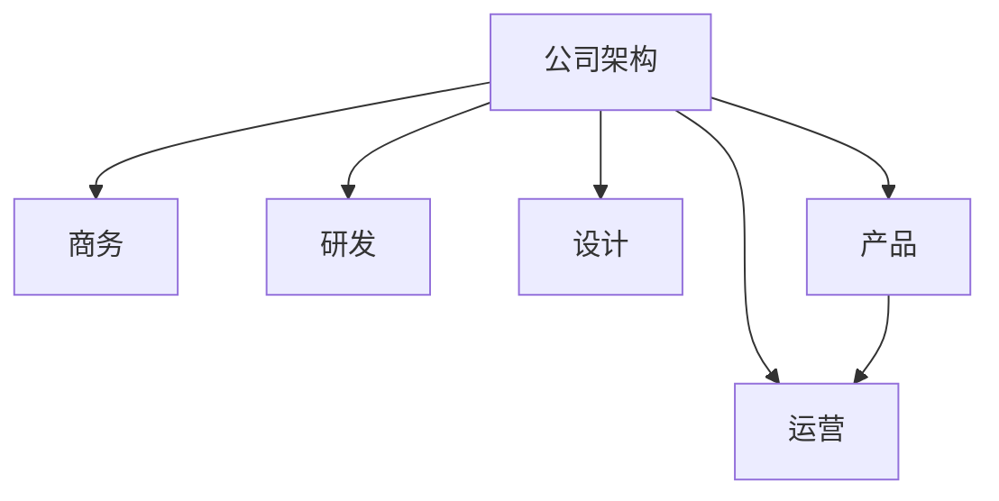
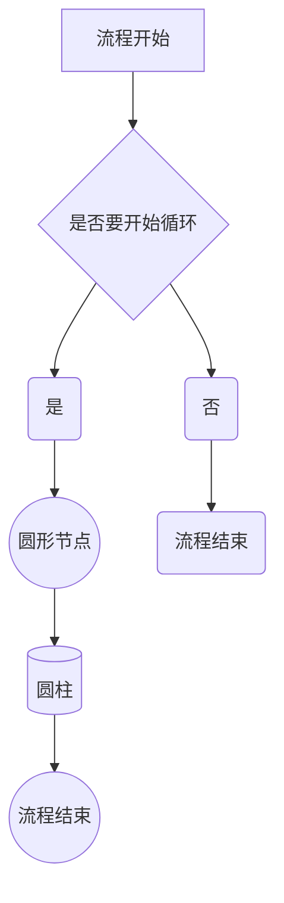
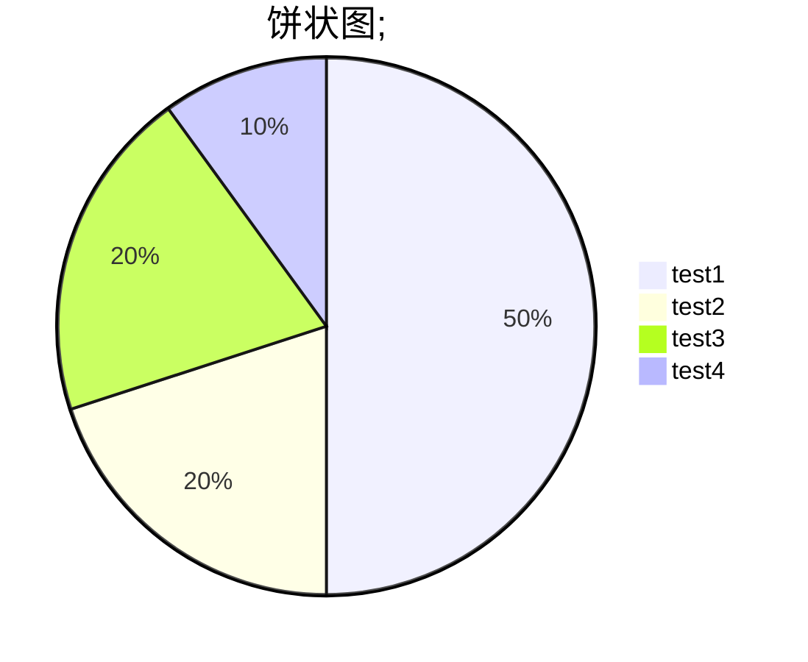
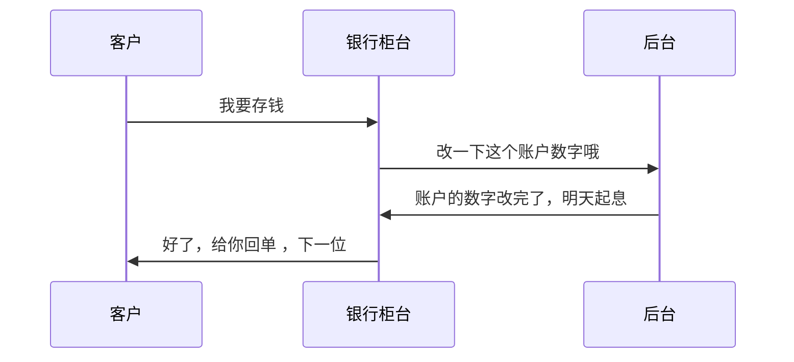

```mermaid
graph TB;
公司架构-->商务
公司架构-->研发
公司架构-->设计
公司架构-->运营
公司架构-->产品
产品-->运营
```

```mermaid
flowchart TB;
流程开始-->id2{是否要开始循环}-->id3(是)
id3(是)-->id6((圆形节点))-->id[(圆柱)]-->id7((流程结束))
id2{是否要开始循环}-->id4(否)-->id5(流程结束)
```

```mermaid
pie title 饼状图;
"test1": 50
"test2": 20
"test3": 20
"test4": 10
```

```mermaid
sequenceDiagram 
客户->>银行柜台: 我要存钱  
银行柜台->>后台: 改一下这个账户数字哦  
后台->>银行柜台: 账户的数字改完了，明天起息  
银行柜台->>客户: 好了，给你回单 ，下一位
```

603
9652
19067
3811
25548
32027
